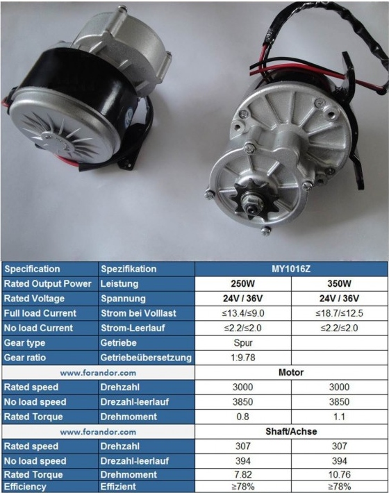
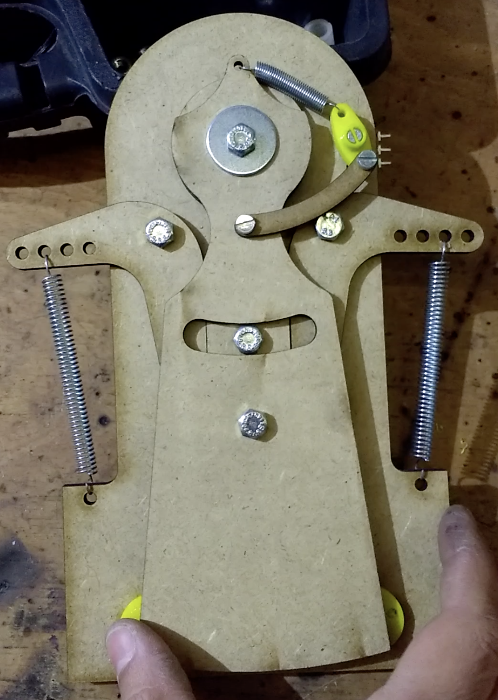
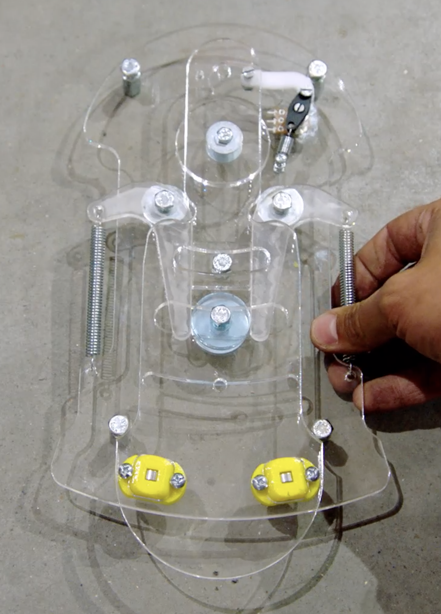
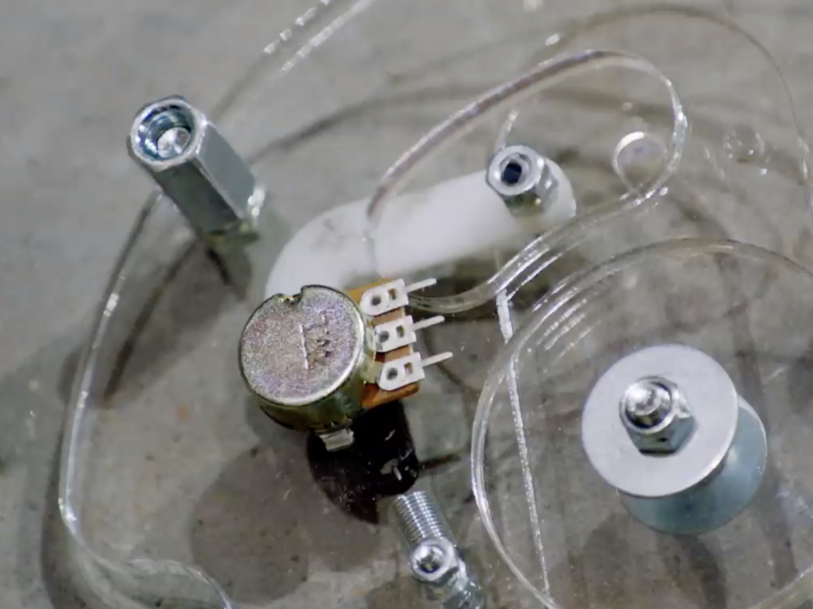
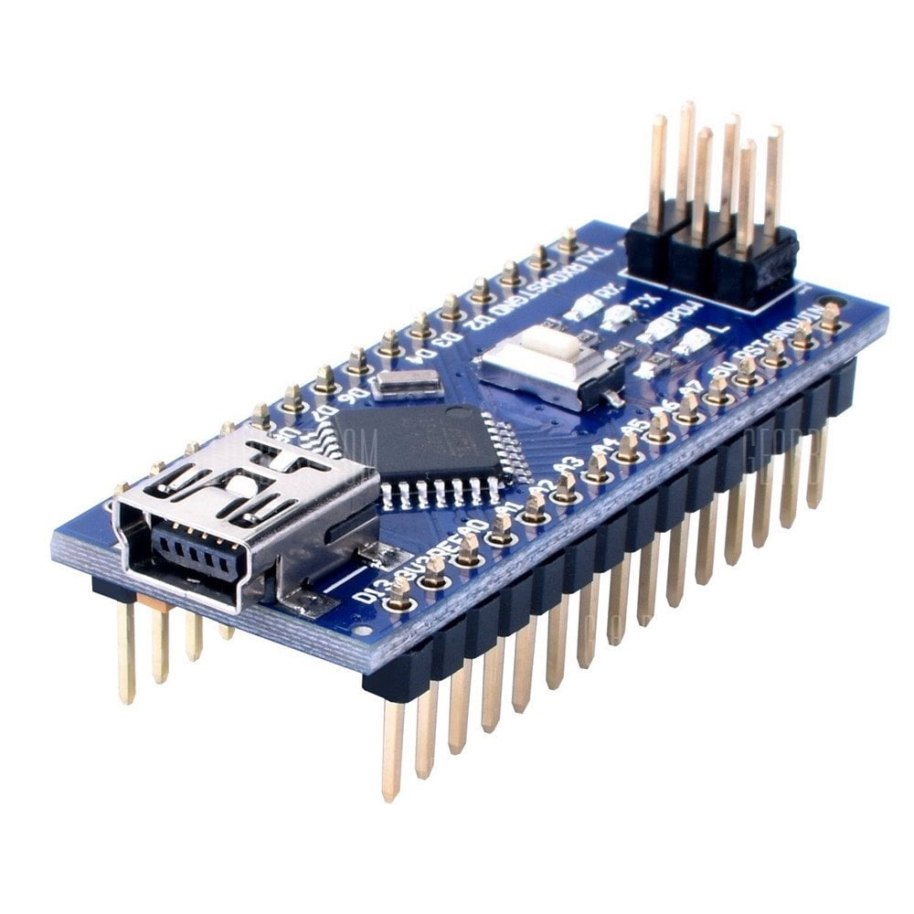
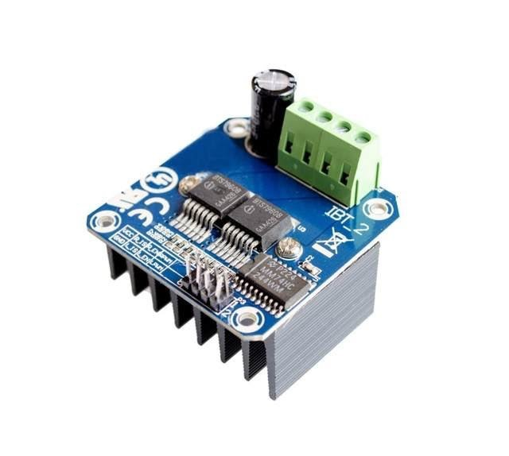
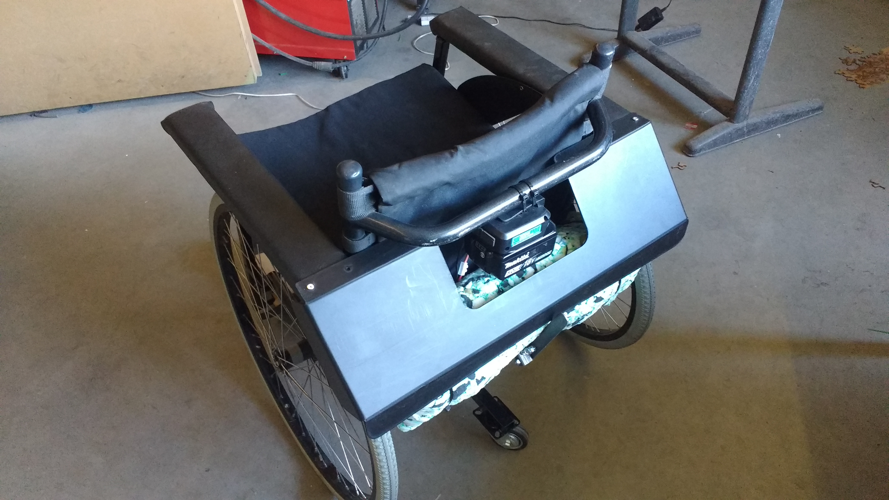

# Dansrolstoel voor Pluim

Kim wil terug dansen met Pluim, maar Pluim zit in een rolstoel en heeft beperkte kracht in zijn lichaam. Hij wil zelf met deze beperkte kracht toch de leiding kunnen nemen en zo terug kunnen dansen met zijn vrouw.

Hardware en software voor de arduino nano in de dansrolstoel van Pluim - ontworpen, geschreven en gemaakt door Ronald Van Ham.

Zie [Team Scheire op canvas.be](https://www.canvas.be/team-scheire/pluim-wil-dansen) voor info en beeldmateriaal.

De oplossing bestaat uit 3 delen:

- motoren op de wielen (onder de zit of achteraan)
- een module onder de voeten. 
- aansturing via een Arduino en h-bruggen

De batterij kan op 1 van deze plaatsen zitten.

## Motoren 

Ze moeten genoeg koppel kunnen leveren. Door de ingebouwde tandwielen is dit mogelijk.

Te verkrijgen via [ali express](https://www.aliexpress.com/w/my1016z-12v.html) of [forandor](https://forandor.com/index.php?route=product/product&path=68&product_id=324)

## Voetbesturing

Het belangrijkste onderdeel is de op maat gemaakte voetbesturing. Pluim kan zijn voeten nog wel rond hun as draaien. 

De voetbesturing leest deze draaibeweging uit, met zo weinig mogelijk weerstand, zodat Pluim zo weinig mogelijk kracht moet zetten.

Op iedere voetbesturing zitten twee kogellagers om de bewegingen met zo weinig mogelijk wrijving te laten gebeuren.

In deze voetbesturing zit een potentiometer langs de onderkant die de draaiing uitmeet.

## Controller

### Arduino nano

Het hart van de controle gebeurt via een Arduino nano, de kleinere versie van de arduino. Op zich kan het uiteraard ook met een gewone Arduino, maar deze nano is kleiner en kwa rekenkracht goed genoeg voor wat nodig is.

De Arduino leest de signalen van de potentiometers in de voetbesturingen uit en zet ze om in signalen voor de twee h-bruggen. Voor elke motor één.

Een Arduino nano is overal te verkrijgen [officiële van Arduino](https://store.arduino.cc/usa/arduino-nano) maar via China zijn er goedkopere varianten te vinden ;).

### BTS7960 H-brug motor driver

Elke motor heeft zijn BTS7960 H-Brug motor driver en deze verwerkt de signalen van de arduino en zet ze om in de juiste stroompulsen voor de motoren.

Een uitleg hoe je met deze H-Brug kan werken staat [op deze instructable](https://www.instructables.com/id/Motor-Driver-BTS7960-43A/) en de specificaties vind je [in deze bijlage](docs/bts7960b-datasheet.pdf).

DE BTS7960 H-Brug motor driver is te verkrijgen via [ali express](https://www.aliexpress.com/w/wholesale-BTS7960.html)

### Connecties
- A0: Batterijspanning via spanningsdeler, om de batterijspanning te controlleren, gekleurde led aan te sturen en indien nodig stoppen om batterij te beschermen. De weerstanden dienen gekozen te worden zodat de spanning nooit (ook niet tijdens het opladen) boven de 5 volt aan de ingang komt. Nadien via voltmeter en serial monitor calibratiefactor bepalen
- A6: Potentiometer onder rechtervoet 
- A7: Potentiometer onder linkervoet 

Deze 2 dienen in software aangepast te worden door te kijken via seriele monitor welke waarde de middenpositie heeft, en wat de 2 uiterste zijn)
Deze waarden vul je in bij RMin, RMid, RMax en LMin, LMid, LMax. Dit dient normaal maar 1 keer te gebeuren, maar soms even checken is niet slecht 

PIN 3, 9, 10, 11 PWM outputs, die gekoppeld zijn aan timer 1 en 2. Dus dan blijft Timer 0 beschikbaar als watchdog timer. We kunnen ook de frequentie van Timer 1 en 2 aanpassen zodat de motoren minder lawaai maken. Let op, de H-Brug moet deze hogere frequentie aankunnen.

Pin 6, 7, 8: GRB LED

## Assemblage

Een controlepaneel achteraan de rolstoel combineert de h-bruggen, de Arduino, de voetbesturing en verdeelt de stroom. Een 12v batterij levert de stroom. Alles mooi weggewerkt achter een beschermkap.

Met een heel mooi resultaat: twee mensen die hun passie terug hebben gevonden: samen kunnen dansen.

